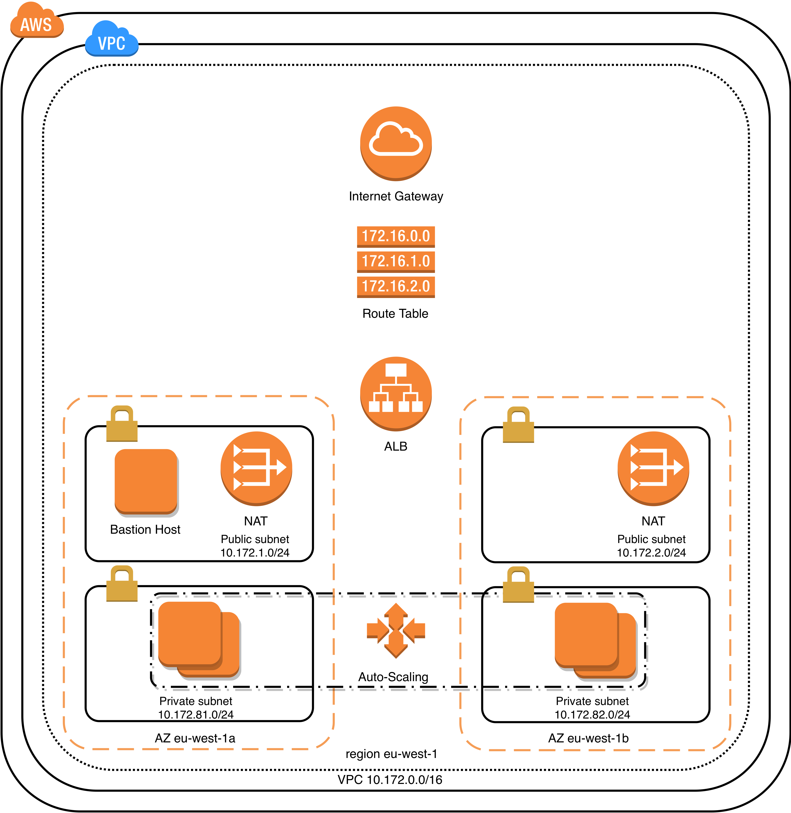
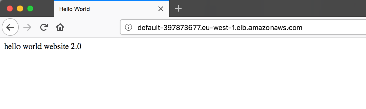

## Gitlab CI demo with Terraform and Packer

This project provisions an AWS Application Load Balancer including the required infrastructure.
It was created mainly for learning purposes and consists of the following building blocks:
- EC2 instance AMI is pre-baked with [Packer](https://www.packer.io) using [Ansible](https://ansible.com) as a provisioner.
- Infrastructure is provisioned using [Terraform](https://www.terraform.io) module.
- Gitlab CI orchestrates actions with Packer and Terraform.

*Note*
- Public and private keys provided are just for demo purposes 
- You are encouraged to create your own ones and edit the *resource "aws_key_pair"* entry in the *aws-demo.tf* file



## Terraform state
Terraform state and plan files are stored on S3 bucket, so it needs to be created beforehand.
No public access is required.


```
# state.tf
terraform {
  backend "s3" {
    bucket = "terraform-remote-state-defo"
    key    = "terraform-state-packer-aws-with-gitlab.tfstate"
    region = "eu-west-1"
  }
}
```

# Manual way

**Set desired AWS credentials**

In this example I am using [**aws-vault**](https://github.com/99designs/aws-vault) to work with desired profile.

```
❯ aws-vault add home
Enter Access Key ID: your-aws-access-key-id
Enter Secret Access Key: your-aws-access-key
Added credentials to profile "home" in vault

# launches subshell with desired AWS environment variables
❯ aws-vault exec -- home
```

**Requirements**
- [Packer](https://www.packer.io)
- [Terraform](https://www.terraform.io)
- [aws-vault](https://github.com/99designs/aws-vault)


```
❯ git clone git@github.com:dmitrijsf/hello-world-gitlab-ci.git
❯ cd hello-world-gitlab-ci
```

**Build AWS AMI using Packer**

Ansible will apply 2 roles:
- common: install common software and perform upgrade
- web: install nginx and copy custom index.html

```
❯ cd packer && packer validate template_ami.json
Template validated successfully.

❯ packer build template_ami.json
amazon-ebs output will be in this color.

==> amazon-ebs: Prevalidating AMI Name: packer-ami 1529266559
    amazon-ebs: Found Image ID: ami-ca0135b3
==> amazon-ebs: Creating temporary keypair: packer_5b26c17f-0903-cb8b-b765-0648cca27038
==> amazon-ebs: Creating temporary security group for this instance: packer_5b26c180-2856-7266-5c9f-2f9747183e4b
==> amazon-ebs: Authorizing access to port 22 from 0.0.0.0/0 in the temporary security group...
==> amazon-ebs: Launching a source AWS instance...
==> amazon-ebs: Adding tags to source instance
    amazon-ebs: Adding tag: "Name": "Packer Builder"
    amazon-ebs: Instance ID: i-0cd68683514e8c5d9
==> amazon-ebs: Waiting for instance (i-0cd68683514e8c5d9) to become ready...
==> amazon-ebs: Waiting for SSH to become available...
==> amazon-ebs: Connected to SSH!
==> amazon-ebs: Uploading scripts => /home/ec2-user/
==> amazon-ebs: Provisioning with shell script: scripts/prepare.sh
-- snip --
    amazon-ebs: Uploading Playbook directory to Ansible staging directory...
    amazon-ebs: Creating directory: /tmp/packer-provisioner-ansible-local/5b26c17f-7a7a-ab3f-f096-0e3a47c4fe90
    amazon-ebs: Uploading main Playbook file...
    amazon-ebs: Uploading inventory file...
    amazon-ebs: Executing Ansible: cd /tmp/packer-provisioner-ansible-local/5b26c17f-7a7a-ab3f-f096-0e3a47c4fe90 && ANSIBLE_FORCE_COLOR=1 PYTHONUNBUFFERED=1 ansible-playbook /tmp/packer-provisioner-ansible-local/5b26c17f-7a7a-ab3f-f096-0e3a47c4fe90/provision_host.yml --extra-vars "packer_build_name=amazon-ebs packer_builder_type=amazon-ebs packer_http_addr="  -c local -i /tmp/packer-provisioner-ansible-local/5b26c17f-7a7a-ab3f-f096-0e3a47c4fe90/packer-provisioner-ansible-local700540066
    amazon-ebs:
    amazon-ebs: PLAY [prepare host] ************************************************************
    amazon-ebs:
    amazon-ebs: TASK [common : install basic packages] *****************************************
    amazon-ebs: changed: [127.0.0.1] => (item=[u'git', u'tree', u'vim', u'htop', u'mlocate'])
    amazon-ebs:
    amazon-ebs: TASK [common : upgrade all packages, including kernel] *************************
    amazon-ebs: changed: [127.0.0.1]
    amazon-ebs:
    amazon-ebs: TASK [web : install nginx] *****************************************************
    amazon-ebs: changed: [127.0.0.1]
    amazon-ebs:
    amazon-ebs: TASK [web : remove web root directory if exists] *******************************
    amazon-ebs: ok: [127.0.0.1]
    amazon-ebs:
    amazon-ebs: TASK [web : create web root directory] *****************************************
    amazon-ebs: changed: [127.0.0.1]
    amazon-ebs:
    amazon-ebs: TASK [web : generate and copy nginx configuration file to server] **************
    amazon-ebs: changed: [127.0.0.1]
    amazon-ebs:
    amazon-ebs: TASK [web : generate and copy index.html file to server] ***********************
    amazon-ebs: changed: [127.0.0.1]
    amazon-ebs:
    amazon-ebs: TASK [web : enable and start http] *********************************************
    amazon-ebs: changed: [127.0.0.1]
    amazon-ebs:
    amazon-ebs: RUNNING HANDLER [web : restart nginx] ******************************************
    amazon-ebs: changed: [127.0.0.1]
    amazon-ebs:
    amazon-ebs: PLAY RECAP *********************************************************************
    amazon-ebs: 127.0.0.1                  : ok=9    changed=8    unreachable=0    failed=0
    amazon-ebs:
==> amazon-ebs: Provisioning with shell script: scripts/cleanup.sh
    amazon-ebs: Uninstalling ansible-2.5.5:
    amazon-ebs: You are using pip version 9.0.3, however version 10.0.1 is available.
    amazon-ebs: You should consider upgrading via the 'pip install --upgrade pip' command.
    amazon-ebs:   Successfully uninstalled ansible-2.5.5
==> amazon-ebs: Stopping the source instance...
    amazon-ebs: Stopping instance, attempt 1
==> amazon-ebs: Waiting for the instance to stop...
==> amazon-ebs: Creating the AMI: packer-ami 1529266559
    amazon-ebs: AMI: ami-47f0f3ad
==> amazon-ebs: Waiting for AMI to become ready...
==> amazon-ebs: Adding tags to AMI (ami-47f0f3ad)...
==> amazon-ebs: Tagging snapshot: snap-04af53cb030792e30
==> amazon-ebs: Creating AMI tags
    amazon-ebs: Adding tag: "Name": "webserver"
    amazon-ebs: Adding tag: "Project": "testing"
==> amazon-ebs: Creating snapshot tags
==> amazon-ebs: Terminating the source AWS instance...
==> amazon-ebs: Cleaning up any extra volumes...
==> amazon-ebs: No volumes to clean up, skipping
==> amazon-ebs: Deleting temporary security group...
==> amazon-ebs: Deleting temporary keypair...
Build 'amazon-ebs' finished.

==> Builds finished. The artifacts of successful builds are:
--> amazon-ebs: AMIs were created:
eu-west-1: ami-47f0f3ad
```

**Build AWS infrastructure using Terraform**

Terraform will build the AWS infrastructure.
Previosly pre-baked AMI will be used in the Auto-Scaling Group.

```
# aws-demo.tfvars
environment = "dev"
vpc_cidr = "10.172.0.0/16"
public_subnet_cidrs = ["10.172.1.0/24", "10.172.2.0/24"]
private_subnet_cidrs = ["10.172.81.0/24", "10.172.82.0/24"]
availability_zones = ["eu-west-1a", "eu-west-1b"]
max_size = 4
min_size = 2
instance_type = "t2.micro"
```

```
❯ cd ../terraform
❯ terraform validate -var-file=aws-demo.tfvars
❯ terraform apply -var-file=aws-demo.tfvars
-- snip --
Apply complete! Resources: 32 added, 0 changed, 0 destroyed.

Outputs:

ALB DNS Name = default-397873677.eu-west-1.elb.amazonaws.com
Bastion DNS Name = ec2-34-247-38-196.eu-west-1.compute.amazonaws.com
```

**Test web access**



**Access the instances**

```
# ssh to bastion host
❯ ssh -i aws_fake_key ubuntu@ec2-34-247-38-196.eu-west-1.compute.amazonaws.com
Are you sure you want to continue connecting (yes/no)? yes
ubuntu@ip-10-172-1-73:~$

# ssh to the instance through the bastion host
❯ ssh-add -K aws_fake_key
❯ ssh -A ubuntu@ec2-34-247-38-196.eu-west-1.compute.amazonaws.com
ubuntu@ip-10-172-1-73:~$ ssh ec2-user@10.172.82.192
Warning: Permanently added '10.172.82.192' (ECDSA) to the list of known hosts.

       __|  __|_  )
       _|  (     /   Amazon Linux AMI
      ___|\___|___|

https://aws.amazon.com/amazon-linux-ami/2018.03-release-notes/
[ec2-user@ip-10-172-82-192 ~]$ service nginx status
nginx (pid 2625 2622) is running...
[ec2-user@ip-10-172-82-192 ~]$
```

**Destroy the environment**

```
❯ terraform destroy -var-file=aws-demo.tfvars
-- snip --
Destroy complete! Resources: 32 destroyed.
```

# Using Gitlab CI

## Configuration

[Gitlab CI](https://about.gitlab.com/features/gitlab-ci-cd/) is used together with [GitLab Runner run in a container](https://docs.gitlab.com/runner/install/docker.html).
GitLab Runner should already be [registered](https://docs.gitlab.com/runner/register/index.html#docker).

You need to pass your [AWS credentials](https://docs.gitlab.com/ee/ci/variables/#secret-variables) to the runner:
- AWS_ACCESS_KEY_ID
- AWS_SECRET_ACCESS_KEY

All CI actions are defined in the [.gitlab-ci.yml](.gitlab-ci.yml) file.

**Docker container for CI**

Each job will trigger the Gitlab runner to launch a [Docker container](https://hub.docker.com/r/dmitrijsf/ci-docker/) to execute commands as instructed in the **gitlab-ci.yml** file.

```
image:
  name: dmitrijsf/ci-docker:latest
  entrypoint:
    - '/usr/bin/env'
    - 'PATH=/usr/local/sbin:/usr/local/bin:/usr/sbin:/usr/bin:/sbin:/bin'
```

**Operations workflow**

Gitlab CI Pipeline is triggered by committing to the repository.
If merged or commited to master, **terraform apply** and **packer build** options are available to run manually.

Edit the variable for S3 bucket (S3_BUCKET) accordingly.

```
variables:
  PACKER_DIR: packer
  TF_DIR: terraform
  PLAN: plan.tfplan
  S3_BUCKET: terraform-remote-state-defo
```

- before_script: verify Packer and Terraform versions and run **terraform init**

- validate stage: run validation of Packer and Terraform configuration

- build-ami stage: pre-bake AWS AMI with desired configuration using Ansible as provisioner

- plan stage: run **terraform plan** and copy the plan file to an S3 bucket

- deploy stage: copy the plan file back from an S3 bucket locally and run  **terraform apply**